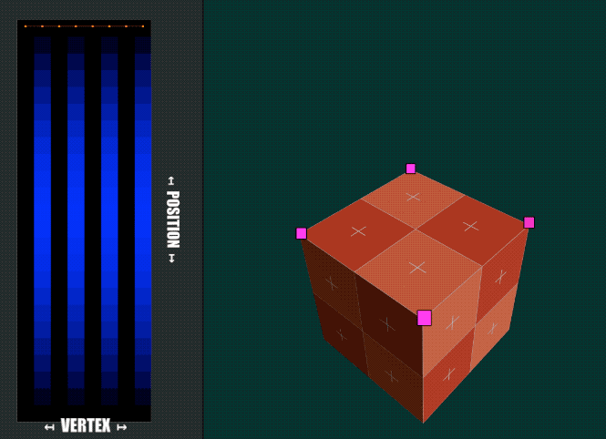

# Vertex Animation Texture in Godot

## VAT Concept
The concept of Vertex Animation Textures (VAT), a technique where vertex motion is baked into textures and played back on the GPU. Instead of using bones or CPU-driven deformation, each vertex reads its animated position (or offset) from a texture in the shader.
In this sample, the cube’s top face moves up and down based on data stored in the VAT. The accompanying texture visualizes this encoded animation, where pixel values represent vertex positions over time. This approach is highly efficient and commonly used for complex effects like simulations, crowds, or procedural deformations.

  

## Export from Blender
To export vertex animation textures from Blender using OpenVAT, ensure that all animations are combined into a single NLA strip—only animation data contained within an active NLA strip will be exported. Before exporting, push your actions to the NLA Editor and arrange them into one continuous strip if needed. For correct shading in Godot, vertex normals should be exported with the same texture on the lower half. 

For more detailed instructions on using the plugin, visit: https://openvat.org

> If exportet as gltf the material is corrupted in Godot and can not be imported directly. Either export the VAT created Model seperatly or create a new Material.

## Import in Godot
-set use external material in settings in import manager in godot, add new material

### Resources
|  |  |
|-------------|--------------|
| Blender addon   | https://openvat.org/       |
| 3d Model        | https://kaylousberg.itch.io/kaykit-adventurers        |